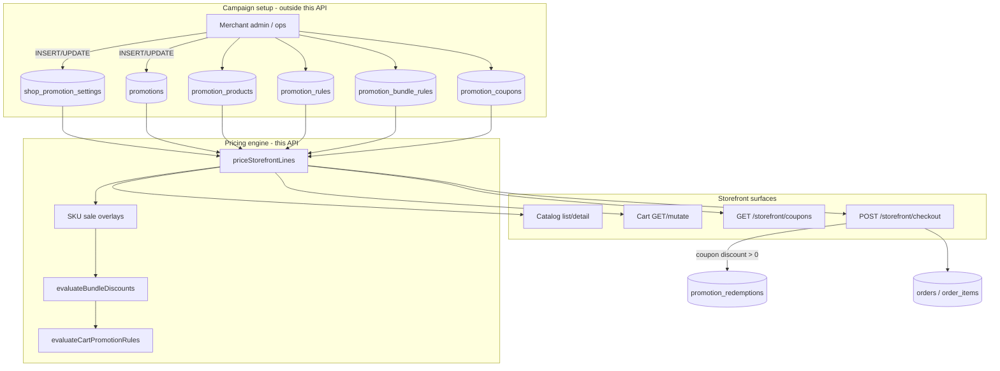

# Promotions workflow (storefront)

This document describes how promotions work in **clientSideEcommerce**: how campaigns are stored, how they appear on catalog/cart/checkout, which tables are read or written, and what to verify when testing.

> **Scope:** This service is the **customer storefront API**. It **reads and applies** promotions; it does **not** create or edit campaigns. Merchant/admin tools (or direct DB/ops) are expected to insert rows into the promotion tables.

---

## 1. High-level architecture



**Single pricing engine:** `priceStorefrontLines` (`src/application/services/promotions/priceStorefrontLines.js`) is used for catalog unit prices, cart totals, and checkout commit. Order of operations:

1. Catalog baseline (list price, optional offer price on `shop_products`)
2. **SKU promotion** (`promotion_products` → promotional unit price)
3. Line subtotals
4. **Bundle / BXGY** (`promotion_bundle_rules`)
5. **Coupon cart rules** (`promotion_rules` via `promotion_coupons`) on **post-bundle subtotal**
6. Payable subtotal (delivery fee added separately at checkout)

---

## 2. Database tables

### 2.1 Configuration

| Table | Purpose | Written by storefront? |
|-------|---------|------------------------|
| `shop_promotion_settings` | One row per shop: pause switch, overlap mode, coupon limits, bundle combine | **No** (read only) |

Key columns:

| Column | Meaning |
|--------|---------|
| `promotions_paused` | When `true`, no SKU/bundle/coupon discounts apply |
| `default_overlap_mode` | `priority` or `best_for_customer` when multiple SKU promos overlap |
| `default_allow_coupon_after_auto` | Documented default; **not enforced** in pricing code today |
| `first_coupon_eligibility_days` | Window for `new_customer_only` coupons |
| `max_coupons_per_order` | Exposed in coupon list API; checkout accepts **one** `couponCode` |
| `allow_combine_auto_campaigns` | If `false`, at most one bundle rule wins per scope |

Migration: `migrations/001_deployment_postgresql/tables/026_shop_promotion_settings.sql`

---

### 2.2 Campaign container

| Table | Purpose | Written by storefront? |
|-------|---------|------------------------|
| `promotions` | Named campaign: status, date window, priority, overlap overrides | **No** |

| Column | Meaning |
|--------|---------|
| `status` | `draft` \| `active` \| `paused` — only `active` is applied |
| `starts_at` / `ends_at` | Campaign window (inclusive in SQL filters) |
| `priority` | Lower number = higher priority when `overlap_mode = priority` |
| `overlap_mode` | Per-campaign override: `priority` or `best_for_customer` |
| `is_deleted` | Soft delete; hidden from queries |

Migration: `027_promotions.sql`

---

### 2.3 Promotion types (child tables)

| Table | Promotion type | What it stores |
|-------|----------------|----------------|
| `promotion_products` | **SKU sale price** | `shop_product_id` + `promo_price_minor_per_unit` |
| `promotion_rules` | **Cart / category rules** | `rule_kind`, `percent_bps`, `amount_minor`, thresholds, caps |
| `promotion_bundle_rules` | **Buy N get M (BOGO / bundles)** | `buy_qty`, `get_qty`, `scope`, `reward_type` |
| `promotion_coupons` | **Coupon codes** | `code_normalized`, windows, limits, flags |

All child rows reference `promotion_id` → `promotions.id` and duplicate `shop_id` for tenant queries.

Migrations: `028_promotion_products.sql`, `029_promotion_rules.sql`, `030_promotion_bundle_rules.sql`, `031_promotion_coupons.sql`

---

### 2.4 Runtime / order snapshot

| Table | When data is written | What is stored |
|-------|----------------------|----------------|
| `promotion_redemptions` | **Checkout**, only if coupon discount > 0 | `order_id`, `customer_id`, `promotion_id`, `coupon_id`, `discount_minor` |
| `orders` | **Checkout** | `promotion_discount_total_minor`, `coupon_code_normalized`, `applied_promotion_ids` (JSONB) |
| `order_items` | **Checkout** | Per-line `list_price_minor`, `line_discount_minor`, `applied_promotion_ids` |

> Automatic SKU and bundle discounts are reflected on **order totals and line fields** but do **not** get separate `promotion_redemptions` rows today—only coupon redemptions are ledgered.

Migration: `032_promotion_redemptions.sql`, `012_orders.sql`, `013_order_items.sql`

---

### 2.5 Related catalog data (not promotion tables)

| Source | Role |
|--------|------|
| `shop_products.price_minor_per_unit` | List price |
| `shop_products.offer_price_minor_per_unit` | Catalog “offer” below list (baseline before SKU promo) |

---

## 3. Promotion types in detail

### 3.1 Catalog offer (baseline, not `promotions`)

- If `offer_price_minor_per_unit` < list price, the offer is the baseline unit price before any campaign.
- Handled in `resolveStorefrontSkuUnitPrices.js` (`baselineUnitMinorFromCatalog`, `computeStorefrontUnitPricing`).

**Checkpoint:** Product shows offer in catalog; SKU promo stacks on top of that baseline.

---

### 3.2 SKU sale (`promotion_products`)

**Example:** “Summer sale” — T-shirt list ₹500, promo ₹399.

**Setup (admin/ops):**

1. Insert `promotions` row: `status = active`, valid `starts_at`/`ends_at`.
2. Insert `promotion_products` rows: one per `shop_product_id` with `promo_price_minor_per_unit`.

**Apply:**

- `listActivePromotionProductOverlaysForShopProducts` loads active overlays.
- `buildStorefrontListingUnitPriceMap` picks **one winner per SKU** using:
  - `shop_promotion_settings.default_overlap_mode` (or per-promotion `overlap_mode`)
  - `priority`: lowest `promotions.priority` wins
  - `best_for_customer`: lowest `promo_price_minor_per_unit` wins

**Checkpoint:**

- [ ] Campaign `active`, not deleted, dates include “now”
- [ ] `promotions_paused = false` on shop settings
- [ ] Catalog shows `final_price_minor` / `promo_discount_minor`
- [ ] Cart line `applied_promotion_ids` includes campaign UUID when promo price used

---

### 3.3 Bundle / Buy-N-Get-M (`promotion_bundle_rules`)

**Examples:**

| Offer | `scope` | `buy_qty` | `get_qty` | `reward_type` |
|-------|---------|-----------|-----------|---------------|
| Buy 2 get 1 free (same SKU) | `same_shop_product` | 2 | 1 | `free` |
| Buy 2 get 1 at 50% off | `same_shop_product` | 2 | 1 | `percent_off_reward` + `reward_percent_bps = 5000` |
| Buy 3 from category, get 1 free | `global_category` | 3 | 1 | `free` |

**Logic** (`evaluateBundleDiscounts.js`):

- For each `buy_qty` **paid** units, customer gets `get_qty` **reward** units.
- `same_shop_product`: free/discount computed per cart line for that SKU.
- `global_category`: pools quantity across lines in category; discount on cheapest units.
- `reward_type`:
  - `free` — full unit value of free units as discount
  - `percent_off_reward` — `reward_percent_bps` applied to free units (100 bps = 1%)

**Cart display:**

- `paid_quantity`, `free_quantity`, `display_quantity` on priced lines
- `bundle_discount_minor` on line and in cart summary

**Combine:** If `allow_combine_auto_campaigns = false`, one winning bundle rule per scope (`same_shop_product` or `global_category`).

**Checkpoint:**

- [ ] `shop_product_id` set when `scope = same_shop_product`
- [ ] `global_category_id` set when `scope = global_category`
- [ ] Cart quantity triggers expected free units (e.g. qty 4 with buy-2-get-1 → 2 free)
- [ ] Product detail API includes `bundle_rules` (from `listActiveBundleRulesForProduct`)

---

### 3.4 Coupon codes (`promotion_coupons` + `promotion_rules`)

A coupon is a **code** linked to a **promotion**. The discount comes from `promotion_rules` on that promotion—not from the coupon row itself (except limits/flags).

**Setup (admin/ops):**

1. Create `promotions` + `promotion_rules` (cart/category rules).
2. Create `promotion_coupons` with `code_normalized` (see **code normalization** below).
3. Optional: also attach `promotion_products` or `promotion_bundle_rules` to the same promotion for automatic discounts when the code is not used.

**`promotion_rules.rule_kind` values** (`evaluatePromotionRules.js`):

| `rule_kind` | Behavior |
|-------------|----------|
| `cart_percent_off` | `subtotal × percent_bps / 10000`, optional `max_discount_minor` |
| `cart_fixed_off` | `min(amount_minor, subtotal)` |
| `cart_percent_off_if_subtotal_above` | Requires `min_subtotal_minor` on rule, then % off |
| `cart_fixed_off_if_subtotal_above` | Requires threshold, then fixed off |
| `category_percent_off` | % off sum of lines matching `global_category_id` |

Multiple rules on one promotion **sum**.

**Coupon-only flags** (`promotion_coupons`):

| Flag / field | Check |
|--------------|-------|
| `min_subtotal_minor` | Compared to **subtotal after bundles** |
| `first_order_only` | Customer must have **zero** `orders` with `status = 'delivered'` |
| `new_customer_only` | `customers.created_at` within `first_coupon_eligibility_days` |
| `max_redemptions_total` | Count rows in `promotion_redemptions` for coupon |
| `max_redemptions_per_customer` | Per-customer redemption count |
| `starts_at` / `ends_at` | Coupon window (can differ from parent promotion) |

**Code normalization:**

- API normalizes input with **`trim()` + `toUpperCase()`** (`normalizeCouponCode` in cart/checkout).
- DB column is `code_normalized`; storage must match what lookups expect (migration comment suggests lowercase—**store codes consistently** with how the API queries).

**Invalid coupon cases:**

| Code | Cause |
|------|-------|
| `COUPON_NOT_FOUND` | No active coupon for shop |
| `COUPON_NOT_APPLICABLE` | Promotion has SKU products only, no cart rules |
| `COUPON_NO_CART_BENEFIT` | `has_coupon_rules` false |
| `MIN_SUBTOTAL_NOT_MET` | Cart below coupon minimum |
| `FIRST_ORDER_ONLY_NOT_MET` | Customer has delivered orders |
| `NEW_CUSTOMER_ONLY_NOT_MET` | Account too old |
| `COUPON_EXHAUSTED` | Total or per-customer cap reached |
| `EMPTY_CART_WITH_COUPON` | Coupon sent with zero lines |

---

## 4. API surfaces (storefront)

All routes require customer JWT + shop access unless noted.

| Method | Route | Query/body | Service |
|--------|-------|------------|---------|
| `GET` | `/storefront/coupons` | `code?`, `cartSubtotalMinor?`, `onlyApplicable?`, `limit?` | `listApplicableCoupons` |
| `GET` | `/storefront/cart` | `couponCode?`, `includeSuggestedCoupons?` | `storefrontCart.getCartContents` |
| `POST/PATCH/DELETE` | `/storefront/cart/items` | `couponCode` in query/body | Rebuilds cart with pricing |
| `GET` | `/storefront/products` | — | Catalog + listing promos |
| `GET` | `/storefront/products/:slug` | — | Detail + `bundle_rules` |
| `POST` | `/storefront/checkout` | `couponCode` in body | `checkoutStorefront` |

Controllers: `storefrontPromotionsController.js`, `storefrontCartController.js`, `storefrontCheckoutController.js`  
Routes: `src/interface/http/routes/storefrontRoutes.js`

**No admin promotion CRUD** exists in this repository.

---

## 5. End-to-end flows

### 5.1 Creating / adding a promotion

**Not done in this API.** Typical merchant flow (external system):

```
1. shop_promotion_settings     (once per shop, or update)
2. promotions                  (campaign shell)
3. One or more child tables:
   - promotion_products        (SKU prices)
   - promotion_rules           (cart/category % or fixed)
   - promotion_bundle_rules    (BOGO)
   - promotion_coupons         (codes + limits)
4. Set promotions.status = 'active' when ready
```

**Tables touched:** `promotions`, child tables above. **No storefront writes** until a customer checks out with a coupon.

---

### 5.2 Listing promotions (discovery)

#### A. Product catalog

1. `storefrontListingPromotions.loadListingContext` loads settings, SKU overlays, bundle rules.
2. Each product gets pricing fields: `list_price_minor`, `offer_price_minor`, `final_price_minor`, `promo_discount_minor`, etc.
3. Product detail includes `bundle_rules` (public shape via `mapActiveBundleRulesPublic.js`).
4. If paused: `promotions_paused: true` on response.

**Tables read:** `shop_promotion_settings`, `promotions`, `promotion_products`, `promotion_bundle_rules`, `shop_products`.

#### B. Coupon list

`GET /storefront/coupons` → `listApplicableCoupons`:

1. If `promotions_paused` → empty list.
2. Load customer `created_at`, delivered order count.
3. `listEligibleCouponsWithUsage` — active coupons + redemption counts + rules JSON.
4. Filter exhausted coupons; evaluate `buildCouponEligibility`.
5. Return `benefits` (customer-safe) + `eligibility` per coupon.
6. Optional: `onlyApplicable` + `cartSubtotalMinor` for preview.

**Tables read:** `shop_promotion_settings`, `promotions`, `promotion_coupons`, `promotion_rules`, `promotion_redemptions` (counts), `orders` (delivered count).

---

### 5.3 Applying to cart

```
Client → GET/PATCH cart with couponCode?
    → cartPricing.runPricing
        → priceStorefrontLines (full pipeline)
    → cartViewBuilder + formatStorefrontCartResponse
    → optional: up to 3 suggested coupons (listApplicableCoupons)
```

**Cart vs checkout behavior:**

| Scenario | Cart | Checkout |
|----------|------|----------|
| Invalid coupon | **Soft-fail**: re-price without coupon; `promotions.coupon.status = not_applicable` + `reason_code` | **Hard-fail**: 400, order not created |
| Valid coupon | `status = applied`, `discount_minor` set | Same pricing; persists to order |

**Tables read:** promotion tables + `carts` / `cart_items` + `shop_products`.  
**Tables written:** none (cart items only updated on line mutations, not by pricing).

---

### 5.4 Checkout

```
POST /storefront/checkout { couponCode?, idempotencyKey, ... }
    → validate cart, address, service area
    → buildCheckoutOrderLines → priceStorefrontLines (live catalog prices)
    → insertOrderWithItemsAndOutbox
    → if couponDiscountMinor > 0:
         insertPromotionRedemption
    → clear cart
```

**Order fields set:**

- `orders.promotion_discount_total_minor` = SKU line discounts + bundle + coupon
- `orders.coupon_code_normalized`
- `orders.applied_promotion_ids` (JSON array of promotion UUIDs)
- `order_items.*` line-level discounts and `applied_promotion_ids`

**Tables written:** `orders`, `order_items`, `outbox` (order event), `promotion_redemptions` (coupon only), cart deleted.

**Idempotent replay:** Same `idempotencyKey` returns prior order summary including promo fields (`checkoutIdempotency.js`).

---

## 6. Pricing calculation reference

```
For each cart line:
  unit_final = min(list, offer?) then apply winning SKU promo_price if any
  line_total = quantity × unit_final
  line_discount = compare_at - line_total  (for display)

subtotal_before_bundle = sum(line_total)

Bundle pass:
  subtotal_after_bundles = sum(line_payable)  // paid qty × unit, free qty discounted

Coupon pass (if code):
  coupon_discount = evaluateCartPromotionRules(rules, subtotal_after_bundles, lines)
  coupon_discount = min(coupon_discount, subtotal_after_bundles)

payable_subtotal = subtotal_after_bundles - coupon_discount
promotion_discount_total = line_promo_discounts + bundle_discount + coupon_discount
```

Implementation: `src/application/services/promotions/priceStorefrontLines.js`

---

## 7. QA checkpoints (checklist)

### 7.1 Shop-level

- [ ] Row exists in `shop_promotion_settings` for shop
- [ ] `promotions_paused = false` for normal operation
- [ ] `allow_combine_auto_campaigns` matches expected bundle stacking tests

### 7.2 Campaign eligibility (SQL filters)

Active promotion/coupon must satisfy:

- [ ] `promotions.status = 'active'`
- [ ] `is_deleted = false` on promotion and children
- [ ] `starts_at <= now() <= ends_at` (promotion and coupon windows for codes)
- [ ] Shop ID matches on all rows

### 7.3 SKU promo

- [ ] `promotion_products` row for correct `shop_product_id`
- [ ] Overlapping campaigns: verify `priority` vs `best_for_customer` winner
- [ ] Catalog and cart `final_price_minor` match

### 7.4 Bundle / BOGO

- [ ] Correct `scope` and FK (`shop_product_id` or `global_category_id`)
- [ ] Quantity math: `floor(paid_qty / buy_qty) * get_qty` free units
- [ ] `reward_type` and `reward_percent_bps` for partial rewards
- [ ] Category bundle with multiple SKUs in same category

### 7.5 Coupon

- [ ] `promotion_rules` present (`has_coupon_rules`); not SKU-only promotion
- [ ] `code_normalized` matches API after uppercasing
- [ ] `min_subtotal_minor` tested against **post-bundle** subtotal
- [ ] `first_order_only` / `new_customer_only` with test customers
- [ ] Redemption caps: total and per-customer
- [ ] Cart preview: invalid code → `not_applicable` without 500
- [ ] Checkout: invalid code → 400, no order row

### 7.6 Checkout persistence

- [ ] `orders.promotion_discount_total_minor` equals sum of components
- [ ] `coupon_code_normalized` set when coupon applied
- [ ] `promotion_redemptions` row exists **only** when coupon discount > 0
- [ ] Repeat checkout with same idempotency key does not double-redeem

### 7.7 Edge cases

- [ ] Empty cart + coupon → error on strict paths
- [ ] Promotions paused: catalog flag, empty coupons, no discounts on cart
- [ ] Custom cart lines (`is_custom`) excluded from pricing
- [ ] Bundle reward lines read-only (`:bundle-reward` suffix)

---

## 8. Key source files

| Area | Path |
|------|------|
| Pricing engine | `src/application/services/promotions/priceStorefrontLines.js` |
| Cart rules | `src/application/services/promotions/evaluatePromotionRules.js` |
| Bundles | `src/application/services/promotions/evaluateBundleDiscounts.js` |
| SKU unit prices | `src/application/services/promotions/resolveStorefrontSkuUnitPrices.js` |
| Coupon list | `src/application/services/promotions/listApplicableCoupons.js` |
| Coupon eligibility | `src/application/services/promotions/couponEligibility.js` |
| Catalog promos | `src/application/services/storefront/storefrontListingPromotions.js` |
| Cart pricing wrapper | `src/application/services/storefront/cart/cartPricing.js` |
| Checkout | `src/application/services/checkout/checkoutStorefront.js` |
| Order line build | `src/application/services/checkout/checkoutOrderAssembly.js` |
| PostgreSQL | `src/adapters/repositories/postgres/PromotionRepoPg.js` |
| Port | `src/application/ports/repositories/PromotionRepo.js` |
| Wiring | `src/main/composition.js` |

---

## 9. Tests to run

```bash
npm test -- tests/domain/priceStorefrontLines.test.js
npm test -- tests/domain/evaluatePromotionRules.test.js
npm test -- tests/domain/storefrontCart.test.js
npm test -- tests/domain/checkoutStorefront.test.js
npm test -- tests/domain/publicPromotionBenefits.test.js
```

---

## 10. Known gaps / limitations

| Item | Notes |
|------|-------|
| No promotion CRUD in this API | Campaigns must be created elsewhere |
| `getCustomerCouponDetail` | Service exists but is **not wired** to routes/repo |
| Stacking columns on `promotions` / settings | `stack_*`, `default_allow_coupon_after_auto` — **not enforced** in `priceStorefrontLines` |
| `max_coupons_per_order` | Returned in coupon list; checkout uses single code |
| Redemption ledger | Only **coupon** discounts; auto SKU/bundle not in `promotion_redemptions` |
| Code case in DB | API uppercases; ensure `code_normalized` storage matches lookup |

---

## 11. Example: “Buy 2 Get 1” + coupon

**Campaign setup:**

```sql
-- 1. Campaign
INSERT INTO promotions (shop_id, name, status, starts_at, ends_at, priority)
VALUES (:shopId, 'B2G1 Shirts', 'active', now() - interval '1 day', now() + interval '30 days', 50);

-- 2. Bundle rule (same product)
INSERT INTO promotion_bundle_rules (
  shop_id, promotion_id, scope, shop_product_id,
  buy_qty, get_qty, reward_type
) VALUES (
  :shopId, :promotionId, 'same_shop_product', :productId,
  2, 1, 'free'
);

-- 3. Optional coupon: 10% off cart after bundles
INSERT INTO promotion_rules (shop_id, promotion_id, rule_kind, percent_bps)
VALUES (:shopId, :promoId2, 'cart_percent_off', 1000);

INSERT INTO promotion_coupons (
  shop_id, promotion_id, code_normalized, starts_at, ends_at
) VALUES (
  :shopId, :promoId2, 'SAVE10', now(), now() + interval '30 days'
);
```

**Customer flow:**

1. Adds 3 shirts → cart shows `paid_quantity: 3`, `free_quantity: 1` (if rule applies to qty 3 as buy-2-get-1 twice? Actually floor(3/2)*1 = 1 free for buy 2 get 1).
2. Applies `SAVE10` → cart may show coupon `applied` or `not_applicable` with reason.
3. Checkout → `orders` + `promotion_redemptions` if coupon discount > 0.

---

*Last updated from codebase: clientSideEcommerce storefront promotion services and migrations `026`–`032`.*
