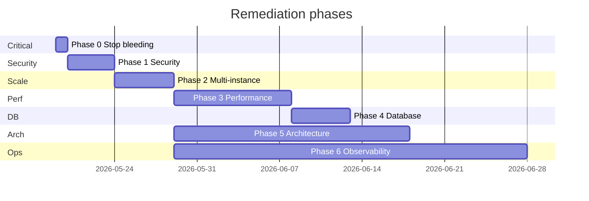

# Executive Summary

This is a **Node.js 22 + Express** ecommerce API with a **clean hexagonal layout** (HTTP → application services → Postgres repos → infra). Data access uses **raw `pg` + SQL**, not Sequelize. Redis backs catalog SWR cache and optional session cache.

| Dimension | Score (1–10) | Summary |
|-----------|--------------|---------|
| **Architecture** | **7.5** | Clear layers, thin controllers, repository ports; some god services and layer leaks |
| **Security** | **6.5** | Strong validation, parameterized SQL, OTP/refresh rotation; critical debug telemetry and several auth/config gaps |
| **Performance** | **6.0** | Catalog Redis SWR is solid; cart and promotions are the main DB hotspots |
| **Scalability** | **6.0** | Mostly stateless HTTP; multi-instance needs Redis for limits/cache; outbox worker not in deploy |
| **Production readiness** | **6.5** | Good Dockerfile, env guards, graceful shutdown; deploy/observability gaps |

**Stack note:** No Socket.IO/WebSocket server in this repo. Realtime is a stub (`emitOrderPlaced: () => {}`). No file-upload handlers in `src/`.

**Strengths:** Zod at boundaries, `AppError` hierarchy, checkout idempotency (DB advisory locks), refresh-token rotation, Helmet/CORS, non-root Docker user, Pino + `x-request-id`, catalog SWR with stampede locks.

**Top risks:** Debug `fetch` to localhost on order paths, `DISABLE_CUSTOMER_AUTH` without production guard, unprotected `/metrics`, cart routes without shop membership checks, in-memory rate limits when scaled horizontally.

---

# Critical Issues

## 1. Debug telemetry posts order data to localhost

- **Severity:** Critical  
- **File:** `src/adapters/repositories/postgres/OrderRepoPg.js` (`debugLog` ~14–21); `src/interface/http/controllers/storefrontOrdersController.js` (~20–38)  
- **Problem:** Production code calls `fetch("http://127.0.0.1:7565/ingest/...")` with order/customer metadata.  
- **Risk:** Unreviewed outbound I/O; data leakage if anything listens on that port; compliance and latency impact.  
- **Recommended fix:** Remove all `#region agent log` blocks before any production deploy.

```javascript
// Delete debugLog() and every call site — do not ship agent instrumentation.
```

## 2. `DISABLE_CUSTOMER_AUTH` bypasses all JWT checks

- **Severity:** Critical (if misconfigured in prod)  
- **File:** `src/main/composition.js` ~82–91; `src/config/env/schema.js` ~38  
- **Problem:** When `DISABLE_CUSTOMER_AUTH=true`, any client can impersonate customers via `x-dev-user-id` / `x-dev-customer-id`. Schema does not forbid this in production.  
- **Risk:** Full account takeover on all `requireCustomerJwt` routes.  
- **Recommended fix:** Fail startup when `NODE_ENV === 'production' && DISABLE_CUSTOMER_AUTH`.

```javascript
// In env schema superRefine:
if (val.NODE_ENV === "production" && val.DISABLE_CUSTOMER_AUTH) {
  ctx.addIssue({ path: ["DISABLE_CUSTOMER_AUTH"], message: "Forbidden in production" });
}
```

## 3. `/metrics` is public when scrape token is unset

- **Severity:** High  
- **File:** `src/interface/http/routes/coreRoutes.js` ~30–44  
- **Problem:** Auth only runs `if (env.METRICS_SCRAPE_TOKEN)`; empty token = open metrics.  
- **Risk:** Attackers learn traffic patterns, cache behavior, route mix.  
- **Recommended fix:** Require `METRICS_SCRAPE_TOKEN` in production or bind `/metrics` to internal network only.

---

# Security Findings

## Issue: Storefront cart APIs skip shop membership checks

- **Severity:** Medium  
- **File:** `src/interface/http/routes/storefrontRoutes.js` ~88–115 (cart routes); compare checkout with `locationGuard` + membership in `checkoutStorefront.js`  
- **Problem:** Valid JWT + arbitrary shop (via `x-shop-id` / host) allows cart CRUD; coupons/orders use `requireCustomerShopAccess`.  
- **Risk:** Cross-shop cart pollution, catalog/pricing probing until checkout blocks.  
- **Recommended fix:** Add `requireCustomerShopAccess` to all cart routes (same as `GET .../coupons` at line 168).

## Issue: JWT session validity cached until token expiry

- **Severity:** Medium  
- **File:** `src/main/composition.js` ~79–80; `src/interface/http/middleware/requireCustomerJwt.js` ~56–90  
- **Problem:** `GET /storefront/cart` and `GET /api/me/profile` cache `isCustomerSessionValid` until JWT `exp`.  
- **Risk:** Revoked/blocked users keep access on those endpoints until token expires.  
- **Recommended fix:** Disable session cache on auth paths or use 30–60s TTL max.

## Issue: Access tokens not bound to per-login session

- **Severity:** Medium  
- **File:** `requireCustomerJwt.js` ~54; `CustomerAuthRepoPg.isCustomerSessionValid`  
- **Problem:** `sessionId = hashToken(token)` is computed but not checked in DB; validation is only “user active + not blocked.”  
- **Risk:** Stolen JWT works until expiry; refresh rotation does not invalidate access tokens.  
- **Recommended fix:** Store `jti` or access-token hash at login; check on each request; bump session version on logout.

## Issue: Default 7-day access token lifetime

- **Severity:** Medium  
- **File:** `src/config/env/defaults.js`; `JWT_ACCESS_EXPIRES_IN` default `7d`  
- **Risk:** Large window for stolen bearer tokens.  
- **Recommended fix:** 15–60 minute access tokens + existing refresh flow; cap TTL in production schema.

## Issue: Rate limits are per-process only

- **Severity:** Medium  
- **File:** `src/interface/http/middleware/createLimiter.js` (no Redis store); `rate-limit-redis` in `package.json` unused  
- **Risk:** With N instances, effective OTP/auth limits = `max × N`.  
- **Recommended fix:** Wire `RedisStore` when `REDIS_URL` is set.

```javascript
import { RedisStore } from "rate-limit-redis";
import { getSharedRedisClient } from "../../../infra/redis/sharedRedis.js";

// Inside createLimiter, when redis client exists:
store: new RedisStore({ sendCommand: (...args) => redis.call(...args) })
```

## Issue: `STOREFRONT_ENFORCE_SERVICEABILITY` defaults off

- **Severity:** Medium  
- **File:** `locationGuard.js`; env defaults  
- **Risk:** Checkout location cookie gate is optional; depends on service-layer checks only.  
- **Recommended fix:** Enable in production where delivery zones matter.

## Issue: Serviceability cookie uses `JWT_SECRET`

- **Severity:** Medium  
- **File:** `src/infra/http/serviceabilityCookie.js`  
- **Risk:** One compromised secret affects JWTs and forgeable cookies.  
- **Recommended fix:** Dedicated `SERVICEABILITY_COOKIE_SECRET`.

## Issue: Refresh-token reuse does not revoke token family

- **Severity:** Low  
- **File:** `rotateCustomerRefreshToken.js`; `CustomerAuthRepoPg.consumeRefreshToken`  
- **Risk:** Weaker than OAuth best practice on stolen refresh tokens.  
- **Recommended fix:** On reuse of consumed refresh token, revoke all refresh rows for that user.

## Issue: Pino redact list incomplete for PII

- **Severity:** Low  
- **File:** `src/config/logger.js` ~12–19  
- **Risk:** `phone`, `email`, `otp` not redacted if body logging expands.  
- **Recommended fix:** Extend redact paths; never log raw auth bodies.

## Issue: Deploy script forces API docs on in production

- **Severity:** Medium  
- **File:** `scripts/cicd/application_start.sh` ~29–34  
- **Problem:** Prepends `ENABLE_API_DOCS=true` and `ALLOW_API_DOCS_IN_PRODUCTION=true`.  
- **Risk:** OpenAPI/Swagger exposed in production unless overridden elsewhere.  
- **Recommended fix:** Remove those lines; keep docs dev/staging only.

### What is already secure

- Zod validation on routes; parameterized SQL; OTP hashed with attempt limits  
- Refresh-token rotation in DB  
- JWT verify with algorithm allowlist, issuer/audience  
- Helmet, CORS allowlist, `httpOnly`/`secure` cookies  
- Production blocks default JWT secrets and `LOG_OTP_IN_DEV`  
- Checkout: membership, idempotency locks, address serviceability  

---

# Performance Findings

## Issue: Cart product sync N+1 queries

- **Impact:** High — dominant cost on multi-item cart GET  
- **Root cause:** `storefrontCart.js` — `pruneUnsellableCartLines` / `syncCartLinesFromCatalog` call `getProductSnapshotForCart()` per line in a loop  
- **Optimization:** Batch with `listLiveProductPricingByIds` (already used at checkout)  
- **Expected improvement:** ~20 lines: ~20 queries → 1–2; **50–90%** less DB time on cart path  

## Issue: Promotions loaded outside catalog Redis cache

- **Impact:** High  
- **Root cause:** `storefrontCatalog.js` — SWR caches product rows; `loadListingPromotionsContext` runs on every list request after cache hit  
- **Optimization:** Cache promotion context per shop (short TTL, invalidate with catalog) or include priced fields in SWR envelope  
- **Expected improvement:** Cached hits: **30–60%** faster product lists  

## Issue: Debug HTTP on order paths

- **Impact:** High (if deployed)  
- **Root cause:** Same as Critical #1  
- **Optimization:** Remove debug `fetch`  
- **Expected improvement:** **10–100ms+** tail latency removed per order-history request  

## Issue: `listApplicableCoupons` on every cart view

- **Impact:** High  
- **Root cause:** `buildCartView` runs full shop coupon query even when only a few suggestions are shown  
- **Optimization:** Skip when cart empty; cache by `(shopId, customerId, subtotal bucket)`; narrow SQL to top-N  
- **Expected improvement:** **20–40%** faster cart GET when promotions enabled  

## Issue: Triple `listCartItems` on cart rebuild

- **Impact:** Medium–High  
- **Root cause:** `buildCartView` re-lists items up to 3 times after prune/sync  
- **Optimization:** Return updated rows from mutations; single final list  
- **Expected improvement:** ~**2×** less cart-item query cost on sync paths  

## Issue: Per-line image LATERAL on cart items

- **Impact:** Medium–High  
- **Root cause:** `CartRepoPg.listCartItems` — image subquery per row  
- **Optimization:** Denormalize thumbnail on cart snapshot at write time; lazy-load images  
- **Expected improvement:** **30–50%** faster `listCartItems` for 10+ lines  

## Issue: Catalog search `ILIKE '%term%'` cannot use btree indexes

- **Impact:** Medium at scale  
- **Root cause:** `catalogSearchPattern.js` → leading wildcards; no `pg_trgm` in migrations  
- **Optimization:** Prefix search for typeahead; add trigram index only with ops approval  
- **Expected improvement:** **5–20×** on text search for large catalogs  

## Issue: Redis catalog invalidation via `SCAN` + `DEL`

- **Impact:** Medium under large keyspaces  
- **Root cause:** `catalogCache.invalidateShopCatalog`  
- **Optimization:** Versioned keys (`shop:{id}:v:{ver}:*`) instead of pattern scan  
- **Expected improvement:** Invalidation from seconds to **&lt;5ms**  

## Issue: Outbox worker sequential connections and in-loop sleeps

- **Impact:** Medium  
- **Root cause:** `outboxProcessor.js` — new `pool.connect()` per message; `await wait()` in loop  
- **Optimization:** Reuse client per batch; schedule retries via `visible_at`  
- **Expected improvement:** **2–5×** outbox throughput under retry load  

## Issue: Checkout order items inserted one-by-one

- **Impact:** Medium  
- **Root cause:** `OrderRepoPg.insertOrderWithItemsAndOutbox` — N INSERTs in transaction  
- **Optimization:** Multi-row `INSERT` or `unnest` batch  
- **Expected improvement:** **20–40%** faster checkout commit for large carts  

## Issue: Oversized product list payloads

- **Impact:** Medium (bandwidth / mobile parse)  
- **Root cause:** `listProducts` returns flat `products` and nested `categories[].products` with up to 6 images each  
- **Optimization:** One shape per endpoint; thumbnails only on list  
- **Expected improvement:** **30–60%** smaller JSON  

---

# Architecture Findings

## Layered structure (good)

```
Client → Express (server.js) → Middleware → Controllers → Services → Repos (pg) → PostgreSQL
                                              ↘ Redis (catalog, session cache)
```

| Layer | Location | Assessment |
|-------|----------|------------|
| HTTP | `src/interface/http/` | Thin controllers, Zod validation |
| Application | `src/application/services/` + `ports/` | Business logic; some 500+ LOC services |
| Adapters | `src/adapters/repositories/postgres/` | SQL repos, tenant context |
| Composition | `src/main/composition.js` | Central DI; ~255 lines, mixed policies |

## SOLID / clean architecture issues

| Principle | Issue | Location |
|-----------|-------|----------|
| **SRP** | God services mix pricing, cart sync, coupons, persistence | `storefrontCart.js` (~512 LOC), `checkoutStorefront.js` (~471 LOC) |
| **DIP** | Application service uses `pool.connect()` directly | `storefrontCatalog.js` L50, L143–195 |
| **ISP** | Large composition root wires everything | `composition.js` |
| **OCP** | Realtime stub; OAuth empty | `composition.js` L189–191; `oauthController.js` |

**Not fat controllers** — complexity sits in services and composition.

## Error handling gaps

- No `process.on('unhandledRejection')` / `uncaughtException` handlers  
- Auth middleware swallows JWT errors as generic 401 (`requireCustomerJwt.js` ~114–121)  
- Controllers use manual `try/catch` instead of a shared async wrapper  
- `errorHandler` may log full `err` object on 500s (`errorHandler.js` ~33)  
- Duplicate `/health` definitions (`server.js` vs `coreRoutes.js`)  

## Logging / monitoring gaps

- `requestId` not propagated to a child logger in all services (only manual in checkout)  
- In-process metrics (`requestMetrics.js`) — not aggregatable across replicas  
- No OpenTelemetry / Prometheus exporter / Sentry  
- `METRICS_SCRAPE_TOKEN` optional in production  
- `pino-pretty` in production `dependencies`  

## WebSocket / realtime

- **Not implemented** — `emitOrderPlaced` is a no-op; outbox handlers only log  
- Future Socket.IO would need: connect auth, Redis adapter, replace stub  

---

# Database Optimization Suggestions

*(Suggestions only — no table creation.)*

## Missing index: `carts(shop_id, customer_id)`

- **File:** `migrations/001_deployment_postgresql/tables/010_carts.sql` — table only; no composite index  
- **Query:** `CartRepoPg.findCartByShopAndCustomerId` — `WHERE shop_id = $1 AND customer_id = $2`  
- **Why:** Seq scan as carts grow per shop  
- **Fix (after approval):**

```sql
CREATE INDEX CONCURRENTLY IF NOT EXISTS idx_carts_shop_customer
  ON carts (shop_id, customer_id);
```

## Strong existing indexes (good)

Orders, shop products, OTP challenges, outbox, memberships — see `migrations/001_full_schema.sql` (~682–1012).

## Transaction usage (good)

Checkout uses advisory locks + transactional order insert. Ensure all multi-step writes (cart + inventory) stay in one transaction where consistency matters.

## Search optimization

- Leading-wildcard `ILIKE` cannot use `idx_global_products_name_lower`  
- Category listing uses recursive `EXISTS` per row — consider precomputed “categories with stock” per shop for hot paths  

## Data consistency

- `carts` has no `UNIQUE (shop_id, customer_id)` in schema — risk of duplicate carts per customer/shop; app should use upsert or unique constraint if product allows  

---

# Redis Optimization Suggestions

| Area | Current | Recommendation |
|------|---------|----------------|
| **Catalog** | SWR with background refresh + lock (`catalogCache.js`) | Good; remove `console.log` on stale hits if present |
| **Invalidation** | `SCAN` + `DEL` by pattern | Versioned keys or per-shop SET of keys |
| **Session cache** | Optional; silent fallback on Redis errors | Alert on Redis failures; avoid unbounded DB session checks |
| **Rate limits** | Not using Redis | Wire `rate-limit-redis` — required for fair limits at scale |
| **Stampede** | SWR lock via `SET NX EX` | Already handled for catalog refresh |

**Production:** Treat `REDIS_URL` as required for multi-instance deploys (catalog cache + rate limits + session cache).

---

# AWS Cost Optimization Suggestions

| Area | Observation | Savings idea |
|------|-------------|--------------|
| **App tier** | Single API container in `docker-compose.yml`; scale multiplies DB pool (`DATABASE_POOL_MAX_PROD=30` × instances) | Right-size pool per instance; use RDS Proxy or PgBouncer before adding many nodes |
| **Redis** | Optional today — without it each instance does full DB + in-memory limits | One small ElastiCache node often cheaper than extra API CPU/DB load |
| **Outbox worker** | `src/workers/outbox.worker.js` not in deploy — events may retry inefficiently in API process | Run worker as separate small task (Fargate/second container) vs scaling API for background work |
| **Debug I/O** | localhost `fetch` on orders | Remove — wastes CPU and can cause tail latency spikes |
| **Payload size** | Large catalog/cart JSON | Less egress bandwidth and faster clients |
| **CI** | Integration tests off in `buildspec.yml` | Cheaper builds but higher cost of prod bugs — balance with targeted integration suite |

---

# Quick Wins

1. **Remove** all `#region agent log` / `debugLog` from `OrderRepoPg.js` and `storefrontOrdersController.js`  
2. **Block** `DISABLE_CUSTOMER_AUTH` in production env schema  
3. **Require** `METRICS_SCRAPE_TOKEN` when `NODE_ENV=production`  
4. **Add** `requireCustomerShopAccess` to cart routes in `storefrontRoutes.js`  
5. **Disable** JWT session cache (or cap at 60s) in `composition.js`  
6. **Wire** Redis-backed rate limiting in `createLimiter.js`  
7. **Stop** forcing API docs in `application_start.sh`  
8. **Fix** docker-compose healthcheck (`wget` → Node HTTP like `Dockerfile`)  
9. **Deploy** `outbox.worker.js` as a separate process  
10. **Batch** cart product lookups using existing `listLiveProductPricingByIds`  

---

# Long-Term Improvements

1. **Split god services** — cart (mutations / pricing / coupons), checkout (idempotency / payment / order creation) into focused modules  
2. **Access-token lifecycle** — short-lived JWT + server-side `jti` revocation list in Redis  
3. **Realtime** — Socket.IO + Redis adapter + auth on connect, driven by outbox events (replace `emitOrderPlaced` stub)  
4. **Observability** — OpenTelemetry traces, Prometheus metrics (not in-memory Maps), SLO alerts  
5. **Search** — `pg_trgm` or OpenSearch for catalog search at scale  
6. **Queue** — move heavy work (notifications, analytics) off request path via outbox + dedicated workers  
7. **API versioning** — document and enforce versioning before breaking clients  
8. **Integration tests in CI** — testcontainers for Postgres/Redis on critical paths (checkout, auth)  
9. **Horizontal scaling playbook** — mandatory Redis, connection pool math, readiness-based deploy (`/health/ready` in CodeDeploy)  
10. **OAuth** — implement or remove stub routes and skipped tests  

---

## Scores recap

| Area | Score | One-line verdict |
|------|-------|------------------|
| Security | **6.5/10** | Strong basics; fix debug code, auth flags, cart ACL, metrics |
| Performance | **6.0/10** | Catalog cache good; cart and promotions need batching/caching |
| Scalability | **6.0/10** | Stateless API possible with Redis; worker and rate limits not multi-instance ready |
| Production readiness | **6.5/10** | Solid container and env validation; deploy script and observability need work |

I can turn the top critical/quick-win items into a focused remediation PR if you want that next.


Here is a practical **phased action plan** based on the audit. Each phase is ordered so earlier work reduces risk before you optimize or scale.

---

## Phase 0 — Stop-the-bleeding (same day, before next deploy)

**Goal:** Remove production-only dangers with minimal behavior change.

| # | Action | Why first | Main files |
|---|--------|-----------|------------|
| 0.1 | Remove all debug `fetch` / `debugLog` (`#region agent log`) | Critical data leak + latency | `OrderRepoPg.js`, `storefrontOrdersController.js` |
| 0.2 | Block `DISABLE_CUSTOMER_AUTH` when `NODE_ENV=production` | Prevents full auth bypass if env is wrong | `src/config/env/schema.js` |
| 0.3 | Require `METRICS_SCRAPE_TOKEN` in production (or disable `/metrics` publicly) | Stops infra/traffic fingerprinting | `coreRoutes.js`, `schema.js` |
| 0.4 | Remove API docs flags from deploy script | Stops forcing Swagger in prod | `scripts/cicd/application_start.sh` |
| 0.5 | Smoke test: health, auth, cart GET, checkout, orders list | Confirms nothing broke | Manual or existing tests |

**Exit criteria:** No localhost ingest calls in repo; prod cannot start with dev auth bypass; metrics not public by default.

---

## Phase 1 — Security hardening (1–3 days)

**Goal:** Close access-control and session gaps without API breaking changes.

| # | Action | Risk addressed | Main files |
|---|--------|----------------|------------|
| 1.1 | Add `requireCustomerShopAccess` to all cart routes | Cross-shop cart abuse | `storefrontRoutes.js` |
| 1.2 | Disable or shorten JWT session cache (60s max, or off on cart/profile) | Revoked users still work on GET cart | `composition.js`, `requireCustomerJwt.js` |
| 1.3 | Shorten access token TTL in prod (e.g. 15–60m); keep refresh as-is | Stolen JWT window | `defaults.js`, `schema.js` |
| 1.4 | Add dedicated `SERVICEABILITY_COOKIE_SECRET` (stop reusing `JWT_SECRET`) | Key compromise blast radius | `serviceabilityCookie.js`, env |
| 1.5 | Enable `STOREFRONT_ENFORCE_SERVICEABILITY` in prod where delivery zones matter | Checkout bypass via cookie | env + `locationGuard.js` |
| 1.6 | Extend Pino redact paths (`phone`, `email`, etc.) | PII in logs | `logger.js` |
| 1.7 | On refresh-token reuse, revoke all refresh tokens for user | Stolen refresh handling | `rotateCustomerRefreshToken.js`, `CustomerAuthRepoPg.js` |

**Exit criteria:** Cart requires shop membership like coupons; session revocation effective within cache TTL; prod env checklist documented.

**Tests to add/run:** Cart with JWT for shop A + `x-shop-id` for shop B → 403; blocked user → 401 on GET cart after cache TTL.

---

## Phase 2 — Multi-instance readiness (3–5 days)

**Goal:** Make horizontal scaling safe (Redis + workers + deploy checks).

| # | Action | Why | Main files |
|---|--------|-----|------------|
| 2.1 | Wire `rate-limit-redis` in `createLimiter` when `REDIS_URL` set | Fair OTP/auth limits across pods | `createLimiter.js` |
| 2.2 | Treat `REDIS_URL` as required in prod multi-instance docs/env | Catalog + session + limits | `schema.js`, deploy docs |
| 2.3 | Deploy `outbox.worker.js` as separate container/task | Async events actually processed | `docker-compose.yml`, CodeDeploy/ECS |
| 2.4 | Fix compose healthcheck (`wget` → Node HTTP like Dockerfile) | False unhealthy containers | `docker-compose.yml` |
| 2.5 | CodeDeploy: validate `/health/ready` (DB + Redis), not only `/health` | Traffic to broken instances | `validate_service.sh` |
| 2.6 | Add `process.on('unhandledRejection')` / `uncaughtException` logging + exit | Silent crashes | `bootstrap.js` or `server.js` |

**Exit criteria:** Two API replicas share rate limits; outbox queue drains; deploy fails if DB/Redis down.

---

## Phase 3 — Performance hot paths (1–2 weeks)

**Goal:** Biggest latency wins on cart and catalog (no schema changes unless approved).

| # | Action | Impact | Main files |
|---|--------|--------|------------|
| 3.1 | Batch cart product lookups (`listLiveProductPricingByIds` or similar) | Removes N+1 on cart GET | `storefrontCart.js`, `CartRepoPg.js` |
| 3.2 | Reduce duplicate `listCartItems` calls in `buildCartView` | ~2× less cart SQL | `storefrontCart.js` |
| 3.3 | Defer/narrow `listApplicableCoupons` (skip empty cart, cache, top-N SQL) | Faster cart GET | `storefrontCart.js`, `PromotionRepoPg.js` |
| 3.4 | Cache promotion context per shop (invalidate with catalog) | Catalog list after cache hit | `storefrontCatalog.js` |
| 3.5 | Slim list payloads (flat OR grouped; thumbnail only on list) | Bandwidth + parse time | `storefrontCatalog.js`, OpenAPI if needed |
| 3.6 | Replace catalog invalidation `SCAN` with versioned keys | Safer Redis under load | `catalogCache.js` |
| 3.7 | Batch checkout order-item INSERTs | Faster checkout commit | `OrderRepoPg.js` |
| 3.8 | Outbox: one DB client per batch, retry via `visible_at` not sleep | Higher throughput | `outboxProcessor.js` |

**Exit criteria:** Cart GET p95 improves measurably; catalog list DB queries drop on cache hit; load test on cart + product list.

---

## Phase 4 — Database (ops-approved, no new tables without permission)

**Goal:** Safer lookups and search at scale.

| # | Action | Needs approval? | Notes |
|---|--------|-----------------|-------|
| 4.1 | Add index `carts(shop_id, customer_id)` | Yes (index only) | `CONCURRENTLY` in prod |
| 4.2 | Consider `UNIQUE (shop_id, customer_id)` on carts if product allows | Yes | Prevents duplicate carts |
| 4.3 | Search: prefix `ILIKE` for typeahead; evaluate `pg_trgm` for full search | Yes for extension | Discuss with DBA |
| 4.4 | Category tree: cache “categories with in-stock products” per shop | App/cache layer first | Avoid heavy recursive `EXISTS` per row |

**Exit criteria:** `EXPLAIN` on cart lookup and hot order/list queries show index use.

---

## Phase 5 — Architecture & maintainability (2–4 weeks, parallel-friendly)

**Goal:** Easier changes without big-bang rewrite.

| # | Action | Benefit |
|---|--------|---------|
| 5.1 | Split `storefrontCart.js` → mutations / pricing / view builder | SRP, testability |
| 5.2 | Split `checkoutStorefront.js` → idempotency / order creation / validation | Same |
| 5.3 | Move `storefrontCatalog` direct `pool` usage behind repo or promotion service | Fixes layer leak |
| 5.4 | Shared `asyncHandler` wrapper for controllers | Fewer missed `next(err)` |
| 5.5 | Standardize errors via `next(new NotFoundError(...))` | Consistent 404/403 |
| 5.6 | Implement or delete OAuth stubs + un-skip tests | Less dead surface |

---

## Phase 6 — Observability & production maturity (ongoing)

**Goal:** Operate safely at scale.

| # | Action |
|---|--------|
| 6.1 | Export metrics to Prometheus/CloudWatch (not in-memory Maps only) |
| 6.2 | Request-scoped child logger with `requestId` in all services |
| 6.3 | Add OpenTelemetry or Sentry for traces/errors |
| 6.4 | Integration tests in CI (Postgres + Redis testcontainers) for checkout/auth |
| 6.5 | Document prod env checklist (Redis, metrics token, serviceability, token TTL) |
| 6.6 | Graceful shutdown timeout for hung connections |

---

## Phase 7 — Long-term (when product needs it)

| # | Action |
|---|--------|
| 7.1 | Access-token `jti` + Redis revocation list |
| 7.2 | Realtime: Socket.IO + Redis adapter + outbox-driven `emitOrderPlaced` |
| 7.3 | Dedicated search service or OpenSearch if catalog grows large |
| 7.4 | RDS Proxy / pool sizing playbook per replica count |

---

## Suggested timeline (single team)



Phases 5 and 6 can overlap with 3–4 once Phase 2 is done.

---

## PR strategy (keeps review small)

1. **PR1:** Phase 0 only (debug removal + env guards + deploy script)  
2. **PR2:** Phase 1 cart ACL + session cache  
3. **PR3:** Redis rate limits + outbox worker deploy  
4. **PR4:** Cart batching + duplicate list fix  
5. **PR5:** Catalog/promo cache + payload slimming  
6. **PR6:** DB index migration (separate, ops-reviewed)  

---

## Definition of done (whole program)

- No critical/high audit items open  
- Prod checklist signed off (Redis, secrets, metrics, auth flags, docs off)  
- Load test: cart GET + product list + checkout under 2+ API instances  
- Security regression: shop isolation on cart, revoked user denied  
- Outbox processing monitored (lag, failures)  

---

I'm in **Ask mode**, so I can't apply these changes. If you want this executed phase by phase in the repo, switch to **Agent mode** and say which phase to start with (recommend **Phase 0**)